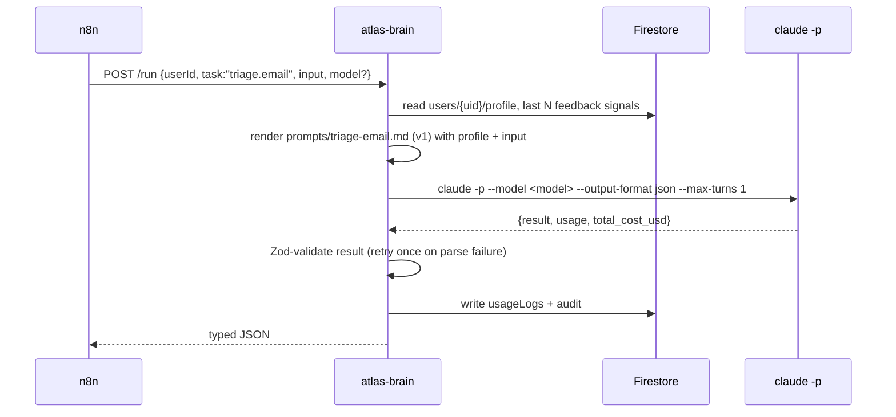
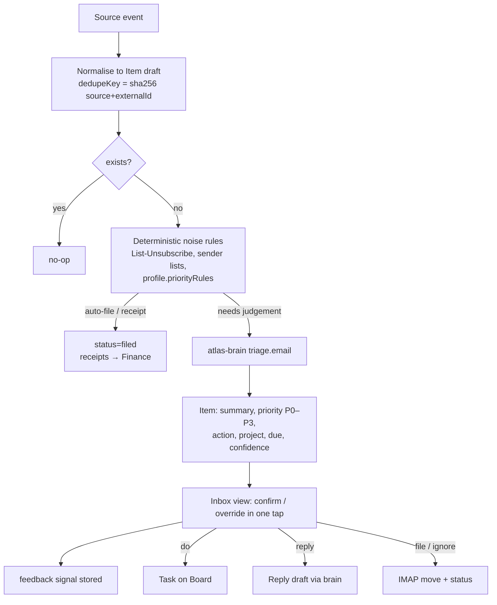

# Atlas — Architecture

> Personal AI Chief of Staff. One Pi brain, one Firebase backend, one Next.js portal, WhatsApp as the pocket channel.
> Multi-tenant by design; invite-only; single Pi serves all users until a second real user exists.

## 1. System context

```mermaid
flowchart LR
    subgraph Inputs
        GM[Gmail x2 + IMAP mailboxes]
        AR[Apple Reminders<br/>iPhone Shortcut bridge]
        WA_IN[WhatsApp inbound<br/>text / receipt photo]
        CSV[Bank CSV exports<br/>weekly upload]
        KB[Knowledge repo<br/>markdown]
    end

    subgraph Pi["Raspberry Pi 5 (brain)"]
        N8N[n8n 2.x<br/>schedules, triggers, glue]
        BRAIN[atlas-brain<br/>Fastify service<br/>wraps `claude -p`]
        CLI[Claude Code CLI<br/>model set per user/task]
        N8N -->|POST /run| BRAIN --> CLI
    end

    subgraph Firebase
        AUTH[Firebase Auth]
        FS[(Firestore<br/>users/{uid}/...)]
        GD[(Google Drive<br/>user folders: files, receipts, attachments)]
    end

    subgraph Vercel
        WEB[Next.js portal<br/>Today · Inbox · Board<br/>OKRs · Content · Finance · Knowledge · Settings]
        API[Route handlers<br/>webhooks, CSV upload, invites]
    end

    UP[(Upstash Redis<br/>job stream + cache)]

    WA_OUT[WhatsApp outbound<br/>nudges, summaries, check-ins]

    GM --> N8N
    AR -->|Shortcut POST| API
    WA_IN -->|Meta webhook| API
    CSV --> WEB
    KB -->|ingest script| BRAIN
    N8N <--> FS
    BRAIN <--> FS
    N8N --> ST
    WEB <--> AUTH
    WEB <--> FS
    WEB <--> ST
    WEB -->|Apple Reminders pull| AR
    N8N --> WA_OUT
    API -->|XADD atlas:jobs| UP
    WEB -->|XADD atlas:jobs| UP
    UP -->|XREADGROUP| BRAIN
    BRAIN -->|dispatch| N8N
```

**Why Upstash:** the Pi sits behind home NAT. Vercel is the only public surface; everything that must reach the Pi (webhooks, portal actions, uploads) is written to an Upstash Redis Stream over REST and pulled by the Pi. No tunnel, no open ports, no dynamic DNS.

## 2. Who does what

| Concern | Owner | Why |
|---|---|---|
| Schedules, polling, retries, webhooks, WhatsApp send/receive | **n8n** | Already running; best-in-class for glue |
| Any judgement (classify, prioritise, draft, summarise, facilitate) | **atlas-brain → Claude Code CLI** | Your requirement: all AI via Claude CLI, model selectable |
| Data, auth, files | **Firebase** | Fixed by brief |
| UI, CSV upload, Reminders webhook endpoint, invite validation | **Next.js (Vercel)** | Server routes use Admin SDK; client uses rules-protected SDK |
| Secrets | `.env` on Pi · Vercel env vars · encrypted per-user docs in Firestore | Never in git |

**Rule of thumb:** n8n never calls Claude directly. It calls `atlas-brain`, which loads the user's profile, picks the model, builds the prompt from `/prompts/*.md`, runs the CLI, validates the JSON with Zod, logs usage + audit, and returns typed output. That keeps prompts, model choice, cost tracking and audit in one place.

## 3. atlas-brain (Pi service)



- **Model resolution order:** request override → `profile.ai.models[task]` → `ATLAS_DEFAULT_MODEL` env. Editable in Settings → AI.
- **Auth:** shared bearer token (`ATLAS_BRAIN_TOKEN`) on localhost only; n8n and brain share the Docker network.
- **Billing:** the CLI runs as a dedicated `atlas` Linux user. It authenticates with either `claude login` (subscription, subject to plan rate limits) **or** `ANTHROPIC_API_KEY` (pay-per-token). Both work; switchable by env. See `docs/decisions.md` ADR-001.
- **Batching:** triage runs on a 2-minute cadence and sends up to 25 items per call. Summaries are cached on the item; re-runs are no-ops thanks to `dedupeKey`.

## 4. Ingestion pipeline (all sources)



Every automated write also lands in `users/{uid}/audit` — the portal renders this as "What your Chief of Staff did today".

## 5. Apple Reminders bridge (iPhone Shortcut, no Mac)

CalDAV cannot see upgraded iCloud Reminders (post-iOS 13), so:

- **Pull (Reminders → Atlas):** Shortcut automation every 30 min (time-based, runs without confirmation on iOS 17+): `Find Reminders where Modified > last run` → `Get Contents of URL` POST to `https://<portal>/api/reminders/push` with a per-user bearer token. Portal upserts Items (`source.type = "reminder"`).
- **Push (Atlas → Reminders):** same Shortcut then GETs `/api/reminders/pending` and applies: create reminder for new Tasks flagged `syncToReminders`, mark complete for Tasks done in Atlas.
- **Trade-off:** ~30 min latency vs zero infrastructure. Reminders whose title starts with `idea:` / `write about` route to Content.

## 6. WhatsApp (Meta Cloud API)

- Inbound webhook → portal → Upstash → brain. Photos/documents → the user's Drive `inbox/` → `receipt.extract` brain task → draft transaction.
- Outbound outside the 24-h window needs **approved templates**. We register: `daily_checkin`, `weekly_truth`, `finance_nudge`, `finance_monthly`, `renewal_due`, `kr_update_prompt`.
- Quiet hours enforced by n8n before every send.
- Commands understood inbound: `kr2 40%`, `done <task>`, `add <task>`, `idea <text>`, `receipt` (+photo), `today`, `status`.

## 7. Vercel ↔ Pi bus (Upstash Redis)

| Key | Type | Purpose |
|---|---|---|
| `atlas:jobs` | Stream | Every job for the Pi: `{ userId, type, payload, enqueuedAt, idempotencyKey }`. Consumer group `pi`, one consumer per brain instance. |
| `atlas:jobs:dlq` | Stream | Jobs that failed 3× — surfaced in `/admin`. |
| `atlas:cache:*` | String, TTL | Cached prompt outputs (summaries, prep briefs) keyed by content hash. |
| `atlas:rl:*` | Counter, TTL | Per-user daily Claude call budget (`profile.ai.dailyCallBudget`). |
| `atlas:heartbeat:pi` | String, TTL 90 s | Pi liveness; `/admin` shows red if missing. |

- Producers: Next.js route handlers (`/api/webhooks/whatsapp`, `/api/reminders/push`, `/api/finance/import`, one-tap Inbox decisions that need a follow-up such as *reply → draft*).
- Consumer: `atlas-brain` polls `XREADGROUP … COUNT 20` every 5 s via the REST API (≈520 k commands/month idle — within Upstash's pay-as-you-go pennies; adjust `ATLAS_POLL_MS`). Jobs are ACKed only after the resulting Firestore write succeeds; `idempotencyKey` makes re-delivery safe.
- Pi → world never needs a public endpoint: results go straight to Firestore, WhatsApp sends go out via n8n → Meta API.
- The local `cos-redis` container stays for n8n's own queue mode; it is not part of the app bus.

## 8. Multi-tenancy

- All data lives under `users/{uid}/...`. Rules deny by default; a user may only touch their own subtree.
- Pi brain and n8n use the Admin SDK but **every function takes `userId` as its first argument**; a nightly "schedulers" workflow iterates active users and enqueues per-user jobs. No global state.
- Invite-only: `invites/{code}` docs; `/register` requires a valid unused code.
- Admin: custom claim `admin: true` on your account → `/admin`.
- Moving the brain off the Pi later = point n8n + brain at a VPS; nothing else changes.
